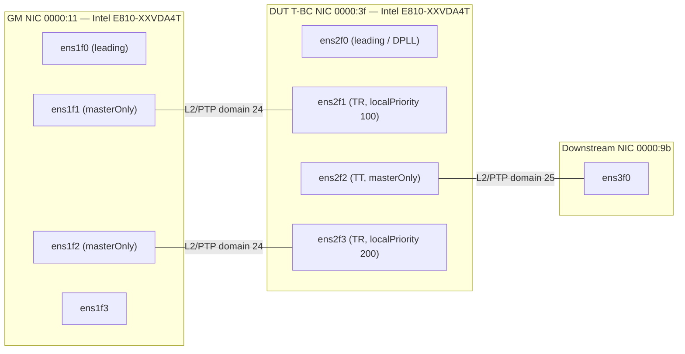

# Lab Topology — cnfdg42 (Single-Node OpenShift)

All three NICs are on the same SNO node (`cnfdg42.ptp.eng.rdu2.dc.redhat.com`). Connections are loopback cables between ports on the same host.

## Topology Diagram



## NICs

| NIC | PCI Address | Model | Role | Interfaces |
|-----|-------------|-------|------|------------|
| GM | 0000:11 | Intel E810-XXVDA4T | Grandmaster (GNSS-locked) | ens1f0 (leading), ens1f1, ens1f2, ens1f3 |
| DUT | 0000:3f | Intel E810-XXVDA4T | T-BC (Device Under Test) | ens2f0 (leading/DPLL), ens2f1, ens2f2, ens2f3 |
| Downstream | 0000:9b | Intel E810 | Downstream client | ens3f0 |

## Connections (loopback cables)

| DUT Port | Role | Connected To | GM Port Role |
|----------|------|-------------|--------------|
| ens2f1 | TR (upstream, localPriority 100) | ens1f1 | GM-A (masterOnly, domain 24) |
| ens2f3 | TR (upstream, localPriority 200) | ens1f2 | GM-B (masterOnly, domain 24) |
| ens2f2 | TT (downstream, masterOnly) | ens3f0 | Downstream client (domain 25) |

## PTP Data Flow

```
GNSS → GM NIC DPLL (ens1f0) → PHC → ptp4l GM-A (ens1f1) ──loopback──→ DUT ens2f1 (TR primary)
                                    → ptp4l GM-B (ens1f2) ──loopback──→ DUT ens2f3 (TR backup)

DUT ptp4l (ens2f1/ens2f3) → PHC → DPLL (ens2f0, SDP22) → ptp4l TT (ens2f2) ──loopback──→ ens3f0
                                                         → phc2sys (-s ens2f1) → CLOCK_REALTIME
```

## DPLL Clock IDs

| Clock ID | NIC | EEC | PPS |
|----------|-----|-----|-----|
| 5799633565436844368 | GM (0000:11) | locked-ho-acq (GNSS) | locked-ho-acq (GNSS) |
| 5799633565440502668 | DUT (0000:3f) | holdover | locked-ho-acq (SDP22/PTP) |
| 5799633565440502432 | Downstream (0000:9b) | unlocked | unlocked |

## PtpConfig Profiles

| Profile | Config | NIC | Description |
|---------|--------|-----|-------------|
| gm-a | gm-ens2f1 | 0000:11 | ptp4l master on ens1f1, clockClass 6, free_running 1, e810 plugin with gnssInput: true |
| gm-b | gm-ens2f1 | 0000:11 | ptp4l master on ens1f2, clockClass 6, free_running 1 |
| tbc-tr | t-bc | 0000:3f | ptp4l slave on ens2f1 (pri 100) + ens2f3 (pri 200), ts2phc, e810 plugin, phc2sys -s ens2f1 |
| tbc-tt | t-bc | 0000:3f | ptp4l master on ens2f2, domain 25, controlled by tbc-tr |
